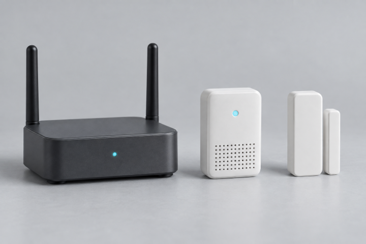
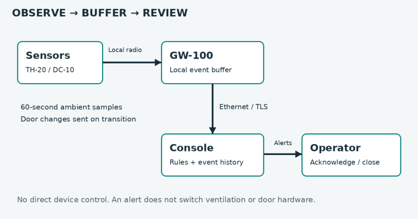
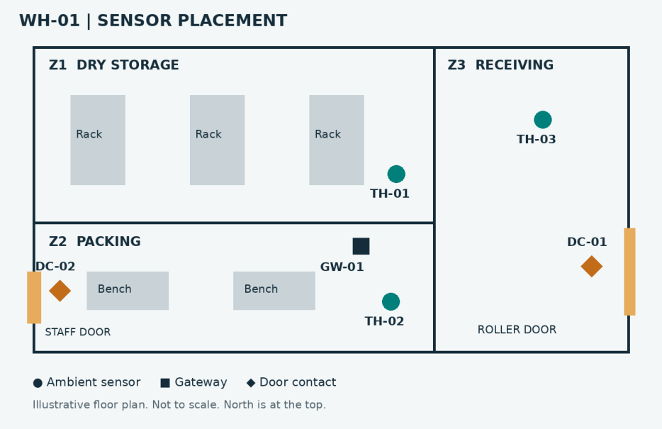
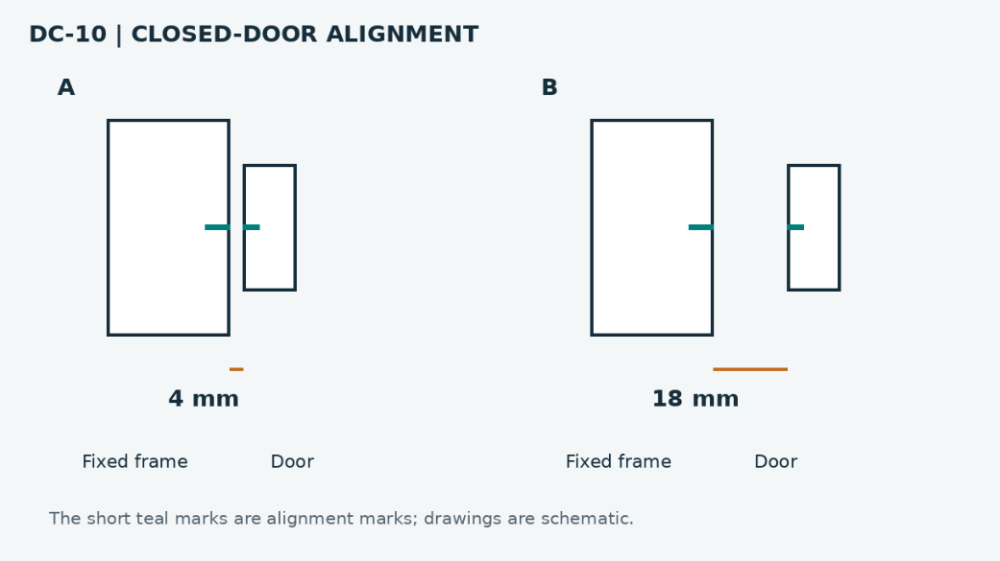
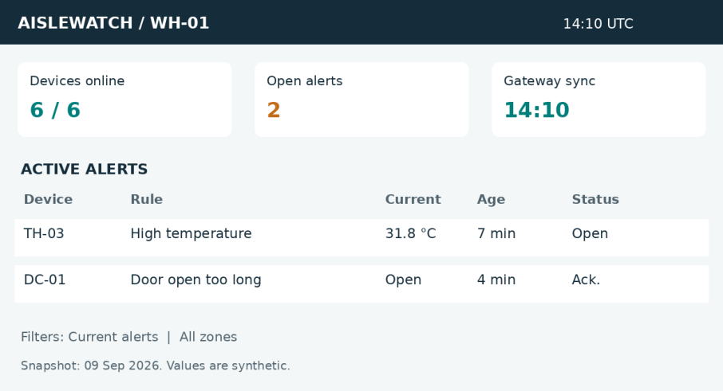
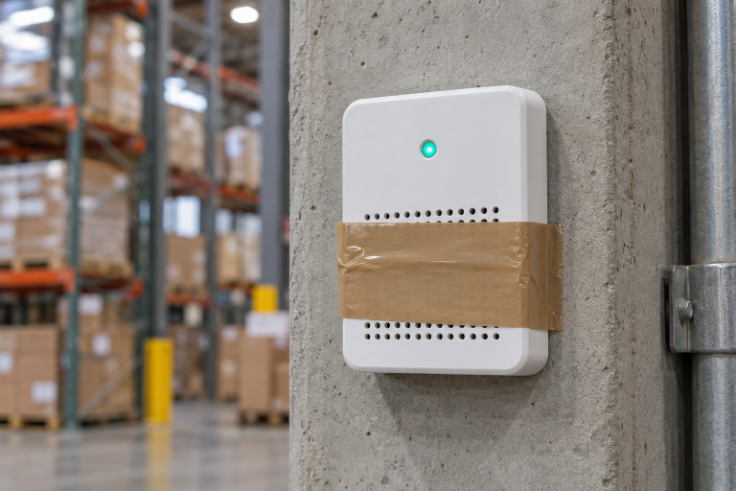

## warehouse_monitoring_product_playbook.pdf-0001-04.png

The image shows four electronic devices arranged in a row from left to right against a neutral gray background. On the far left is a rectangular black device with rounded corners, two vertical antennas, and a single small blue indicator light centered on its front face. Next to it is a white rectangular device with rounded corners, a single circular blue indicator light near the top center, and a grid of small holes covering the lower third of its front face. To the right of this white device are two slim, vertically oriented white modules: the larger module is a plain rectangle with no visible markings, and the smaller module is similarly plain and rectangular but shorter and more narrow, positioned immediately adjacent to the larger module. All devices are on the same surface, spaced evenly apart. No numbers, words, or identifiers are present on or around the devices in the visible portion of the image.

## warehouse_monitoring_product_playbook.pdf-0004-04.png

The image F02-1 shows four distinct devices on a light grey surface. At the left is a black rectangular enclosure with two upright antennas and a single blue LED indicator centered on its front face, visually identifiable as the GW-100 gateway and intended to be installed with ID: GW-01. Next to it, positioned centrally, is a white rectangular enclosure featuring a lower ventilation grille composed of a grid of small holes, with a blue LED indicator above the grille, matching the TH-20 ambient sensor type, which in the kit inventory corresponds to IDs: TH-01 to TH-03. To the right, there are two white devices: the first is a thicker, taller rectangular body, and directly beside it, a narrower, shorter white piece; both components are visually grouped and fitted with blue indicator LEDs, representing the DC-10 door contact devices, paired for operation and corresponding to IDs: DC-01 and DC-02. Their relative sizes in the photograph illustrate the differences in footprint and height among the gateway, ambient sensor, and door contact units, confirming each device model by shape and visual features per the kit inventory T02-1. No mounting pack or gateway accessories are depicted or identifiable in the image.

## warehouse_monitoring_product_playbook.pdf-0006-03.png

The figure is headed with the phrase "OBSERVE → BUFFER → REVIEW," and illustrates a logical event path consisting of four labeled rectangles arranged in a horizontal flow from left to right. At the far left, the first rectangle is labeled "Sensors" with identifiers "TH-20 / DC-10" listed underneath; it is connected via an arrow labeled "Local radio" to the next rectangle, "GW-100," which is described as "Local event buffer." Below this arrow, between Sensors and GW-100, appear two lines of text: "60-second ambient samples" and "Door changes sent on transition." GW-100 is positioned in the middle of the figure, and is connected downward by an arrow labeled "Ethernet / TLS" to a rectangle labeled "Console," which contains the text "Rules + event history." Immediately to the right, Console connects to a rectangle labeled "Operator" via an arrow labeled "Alerts;" Operator’s box states "Acknowledge / close." Across the bottom of the figure, a sentence reads: "No direct device control. An alert does not switch ventilation or door hardware."

## warehouse_monitoring_product_playbook.pdf-0007-04.png

The figure titled WH-01 Sensor Placement displays three zones labeled Z1 DRY STORAGE, Z2 PACKING, and Z3 RECEIVING, with north at the top. Z1 contains three objects labeled Rack and a device labeled TH-01 positioned to the right side of the zone. Z2 contains two objects labeled Bench, a device labeled TH-02 near the lower right, a device labeled GW-01 nearer the upper right, and a door contact labeled DC-02 to the left, adjacent to a feature labeled STAFF DOOR. Z3 contains a device labeled TH-03 roughly central and a door contact labeled DC-01 to the right, adjacent to a feature labeled ROLLER DOOR. A legend beneath the diagram identifies ambient sensors as filled circles, gateways as filled squares, and door contacts as filled diamonds. The image identifier is F05-1.

## warehouse_monitoring_product_playbook.pdf-0008-05.png

The figure is titled "DC-10 | CLOSED-DOOR ALIGNMENT" and presents two schematic examples labeled A and B, each showing a fixed frame and a door with short teal marks on both components, which are identified at the bottom as alignment marks. In example A, the door and frame are positioned close together, with a horizontal orange line beneath indicating the closed-door gap and the label "4 mm" displayed directly above it; beneath each component, "Fixed frame" and "Door" are labeled in sequence from left to right. In example B, the door and frame are farther apart, with a similar orange gap indicator and the label "18 mm" above it; the same order of "Fixed frame" and "Door" appears underneath. The bottom caption states, "The short teal marks are alignment marks; drawings are schematic."

## warehouse_monitoring_product_playbook.pdf-0011-04.png

The image shows a console snapshot labeled AISLEWATCH / WH-01 with the timestamp 14:10 UTC at the top right. It lists three summary boxes: Devices online showing 6 / 6 in green, Open alerts showing 2 in orange, and Gateway sync displaying 14:10 in green. The ACTIVE ALERTS section specifies two entries: device TH-03 with the rule High temperature, a current value of 31.8 °C, age 7 min, and status Open; and device DC-01 with the rule Door open too long, current state Open, age 4 min, and status Ack. Below, filters are set to Current alerts and All zones. The bottom statement reads Snapshot: 09 Sep 2026. Values are synthetic.

## warehouse_monitoring_product_playbook.pdf-0012-03.png

The image shows a rectangular white device, identified in the document as TH-20, visibly mounted on a vertical concrete pillar within what appears to be a warehouse zone. The device features a single round indicator at the top center displaying a green light. Below the indicator are two sets of perforations forming grille patterns, one above and one below the central band of tape. The device is secured with a wide strip of brown adhesive tape horizontally wrapped around its middle, crossing over the grille area. In the background, shelving racks filled with stacked cartons and packages are present, along with a yellow cylindrical column protector. No other numbers, alphanumeric identifiers or label text can be seen on the device or its immediate surroundings in this image.
